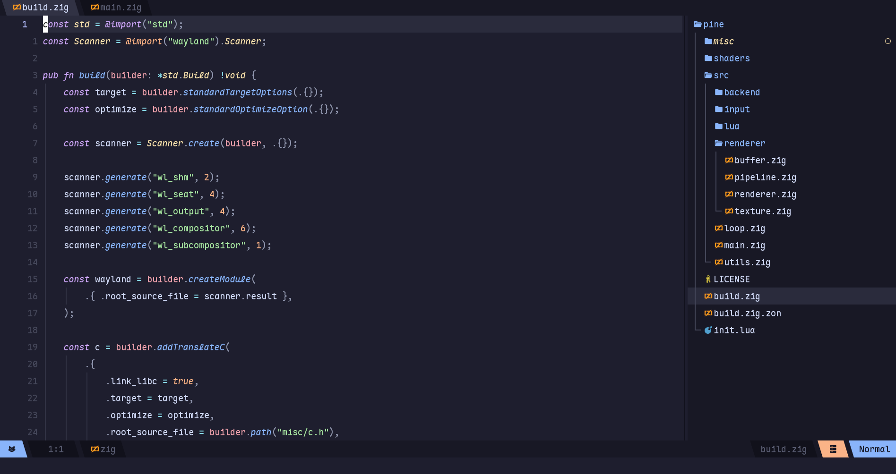

# A Neovim config that fits my needs.

  

## Installation
> [!NOTE]
> - ***Make a backup of your old configuration if you have any.***
> 
> - ***Requires Neovim 0.10+***

    git clone https://github.com/mattatticus/nvim ~/.config/nvim
